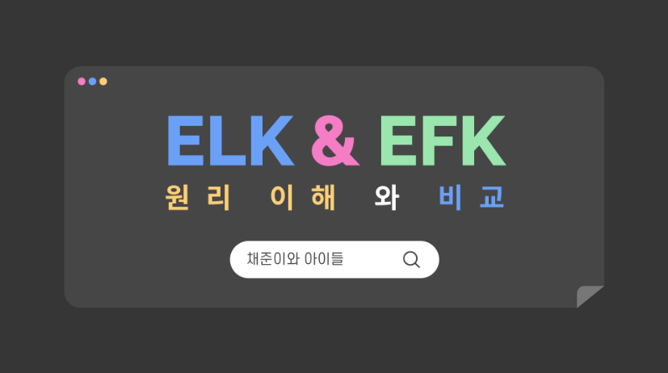
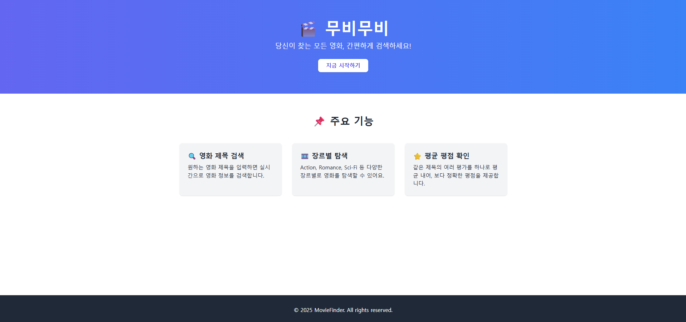

<h1 align="center">
  
</h1>

🚀 백엔드 개발을 시작으로 인프라까지 학습을 확장하고 있습니다.  
👀 최근에는 네트워크와 클라우드에 관심이 많습니다.  

 

<!-- 

  
  

 -->

---

#### 💻 Tech Skills

| Category | Stack |
|----------|-------|
| **Languages** |   |
| **Backend** |    |
| **Auth & Security** |    |
| **Database** |   |
| **Cloud & IaC** |      |
| **Container & Orchestration** |   |
| **CI/CD & DevOps** |     |
| **Monitoring & Observability** |      |
| **Tools** |   |

---

#### 🏆 Awards

| 🎯 대회명 | 🥇 수상명 | 🏛 주최기관 | 📄 설명 |
|-----------|-----------|-------------|---------|
| 최종 프로젝트 | 프로젝트 최우수상 | 우리FIS 아카데미 | 하이브리드 클라우드 기반 취약점 실습 보안 트레이닝 플랫폼 |
| 기술 세미나 | 우수상 | 우리FIS 아카데미 | ELK와 EFK 스택의 구조·원리 이해 및 비교 |
| 기술 세미나 (개인) | 우수상 | 우리FIS 아카데미 | Spring AI 기반 생성형 AI 연동 아키텍처 분석 |

<!-- ---

### 🧮 Algorithm Ranking

  

 -->

---

### 📌 Projects

| No | 프로젝트 이름 | 사진 | 주요 내용 | 링크 |
|---|---|---|---|---|
| 1 | **CVEXPERT** |  | **하이브리드 클라우드 기반 CVE 취약점 실습 플랫폼** | [🔗](https://github.com/fisagmg) |
| 2 | **ELK & EFK** |  | **ELK·EFK 스택을 구축·비교**하여 동작 원리와 성능 차이를 분석 | [🔗](https://github.com/Gill010147/elk_efk_tech_seminar) |
| 3 | **PartitioningDB** |  | **대용량 데이터를 파티셔닝 기법**으로 분할하여 조회 성능을 비교 | [🔗](https://github.com/Minkyoungg0/PartitioningDB.git) |
| 4 | **무비무비** |  | **JPA 활용** 영화 카테고리 & 필터를 구현한 영화 검색 페이지 | [🔗](https://github.com/songhajang/movieJPA) |

---
> 새로운 기술에 도전하고, 배운 것을 나누며 지속적으로 발전하는 개발자가 되겠습니다 🙌
